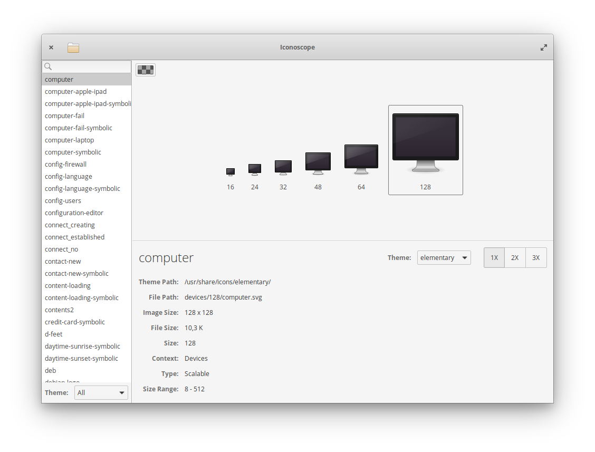

Iconoscope
==========

View installed icons on your system and their properties.

Compilation
-----------

Dependencies:
  * `gtk+-3.0`
  
In elementaryOS/Ubuntu install them with:

    sudo apt-get install libgtk-3-dev

    
Build with:

    ./pymk iconoscope
